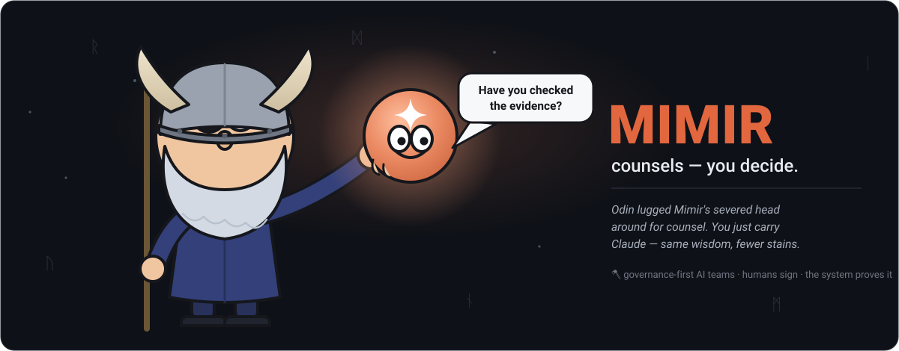
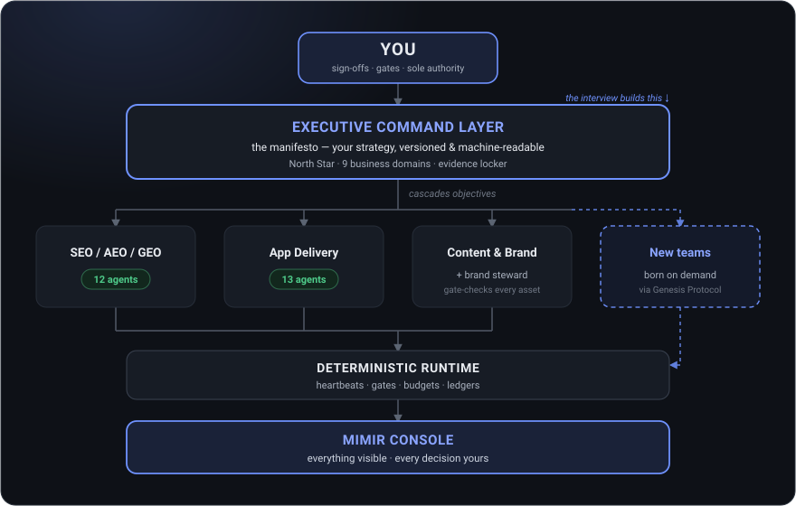

# Mimir — the Organisational Intelligence Engine

<p align="center">
  
</p>

[](https://github.com/rjperry36/mimir/actions)
**AI teams that counsel. Humans who decide. A system that proves it.**

In Norse myth, Odin — the wisest of the gods — still consulted Mimir before
every great decision. Mimir advised; Odin decided. That is the entire design
philosophy of this engine: **specialist AI agent teams do the work, evidence
every claim, and bring you decisions ready to sign — and nothing important
happens without your signature.**

---

## Why Mimir exists

AI agents are astonishingly capable and, out of the box, completely
unaccountable. They'll build you a website, write your marketing, plan your
strategy — and invent statistics, drift off-brief, touch things they
shouldn't, and leave no trail showing why anything happened. For a real
business, that's not a productivity tool; that's a liability with a keyboard.

Mimir is the answer to one question: **what would it take to trust a team of
AI agents with real business work?** The answer turned out to be the same
thing it takes to trust a team of people: a written constitution, clear roles,
quality gates, an audit trail, a boss who signs things off — and consequences
when standards slip. So that's what was built. Not a chatbot, not an
autopilot: **an operating model for AI teams, enforced by software.**

## What you get

### 🏛️ A constitution, not a prompt
Five constitutional documents govern everything: the **Executive Command
Layer** (your business strategy as a versioned, machine-readable manifesto),
the **AI Operating Model** (naming, versioning, authority, lifecycle — the
law every agent obeys), the **Engagement Lifecycle** (right-sized ceremony
from sole-trader to SME), the **Context & Memory Protocol**, and the
**Roster Genesis Protocol**. Every document is semantically versioned with a
changelog. No silent changes, ever.

### 🎤 An interview that refuses to make things up
Onboarding is a consultant-grade structured interview across **nine business
domains** — Finance, Sales, Marketing, Operations, Product, Technology,
HR & People, Legal, AI oversight. It challenges vague answers, stores every
document you provide **verbatim in an evidence locker with provenance and
content hashes**, and marks anything unknown as TBC with a named owner
rather than inventing a number. The output is your **manifesto**: a single
source of truth every agent works from and every claim traces back to.

### 👥 35 specialist agents in 4 teams — with more born on demand
A **12-agent SEO/AEO/GEO team**, a **13-agent application delivery team**
(default stack: Vercel, Neon, Clerk, Resend), a **content & brand team**
with a brand steward who gate-checks everything against your locked brand
elements, and a **recruitment seed team**. Every agent has a defined role,
goal, constraints, quality gates, and a **Goal→Plan→Act→Review→Learn** cycle.
And when your business needs a discipline no team covers, the **Roster
Genesis Protocol** detects it at interview, right-sizes the response, drafts
a proposal — and puts the decision where it belongs: in front of you.

### ✋ Human gates that actually gate
Every significant step — manifesto sign-off, plan approval, releases, brand
changes, legal-adjacent drafts, new teams — lands in your **decision inbox**
with the full document attached, rendered for review, with Approve and
Comment a click away. Contracts are *drafted*, never issued. Hiring is
*recommended*, never decided. Exclusion zones you define are enforced by
policy, and breaches are blocked and logged. The audit trail shows every
decision, who made it, and when.

### 🛡️ Non-fabrication, enforced by architecture
Every agent carries a blocking non-fabrication gate: claims must trace to
your manifesto, your evidence locker, or your explicit input — or they're
stripped and flagged as gaps. In live testing this discipline held under
pressure three separate times, including an agent refusing to rely on an
unsourced detail *in its own tasking brief*.

### ⚙️ A deterministic runtime doing the boring things perfectly
The kernel handles what AI shouldn't: **heartbeat monitoring and dead-agent
detection in seconds**, checkpoint/resume across restarts, a deterministic
gate-runner, **budget-aware pause and resume**, workspace isolation for
parallel agents, timeout/retry/fallback/circuit-breaker resilience around
every tool, and structured state emission to four auditable ledgers.
**44/44 tests passing**, run them yourself in one command.

### 📊 The Mimir Console
A local dashboard that makes the whole operation legible: **wave board**,
**agent metrics timeline**, **learning-by-version** (proof the system
improves), **integrity log**, **decision inbox**, **RAG and RAID boards**,
**document review with version diffs**, the **interview transcript**, and
the **evidence locker** with per-item provenance. Your operation, one screen.

### 🔑 Your keys never leave your machine
Strict **bring-your-own-key** model. The repo ships with zero credentials.
Keys are entered client-side, stay client-side, are redacted everywhere,
fail loud when missing, and a CI secret-scan gate blocks accidental commits.

### 🔁 A system that improves itself — with receipts
Every engagement ends with a LEARN harvest: findings become versioned
improvement proposals, approved changes bump agent versions, and the Console
charts quality per version — so improvement is *attributable*, not assumed.
In its first live engagement, the framework raised **28 improvements about
itself** and shipped 11 of them through its own governance.

### 🔍 Proven in live fire — and audited by an independent adversary
A real business went through the full lifecycle: interview to signed
manifesto, ten delivery waves, a working tested application (100+ backend
tests, WCAG 2.2 AA, zero critical security findings), and cross-team
collaboration. A **deliberately seeded defect was caught independently by
two review agents** — the gates block; they don't rubber-stamp. Then a fresh
adversarial auditor scored the whole system, and **the full verdict ships in
this repo** (`audits/`) alongside a page on what Mimir
[isn't yet](site/what-its-not.html). We market what's proven and publish the
rest — that's the trust model, and it's also the pitch.

## How it works

<p align="center">
  
</p>

```
  YOU ──────────────┐  sign-offs · gates · sole authority
                    ▼
  ┌─────────────────────────────────────────┐
  │  EXECUTIVE COMMAND LAYER (manifesto)    │  ← the interview builds this
  │  North Star · 9 domains · evidence      │
  └──────────────────┬──────────────────────┘
                     │ cascades objectives
     ┌───────────────┼───────────────┬─────────────┐
     ▼               ▼               ▼             ▼
  SEO team      App Dev team    Content team   (born via
  12 agents     13 agents       + brand        Genesis
     │               │          steward        Protocol)
     └───────┬───────┴───────────────┘
             ▼
  DETERMINISTIC RUNTIME  — heartbeats · gates · budgets · ledgers
             ▼
  MIMIR CONSOLE — everything visible · every decision yours
```

1. **Interview** → your strategy becomes a versioned manifesto.
2. **Sign it** → nothing moves until you do.
3. **Size it** → tiers from sole-trader to SME set the right ceremony.
4. **Activate teams** → work runs in dependency-ordered waves through gates.
5. **Approve as you go** → decision inbox, document review, full audit trail.
6. **Learn** → every engagement makes the next one better, verifiably.

## Try it in two minutes

```bash
git clone https://github.com/rjperry36/mimir.git && cd mimir
pip install pyyaml
python3 scripts/validate_framework.py     # the constitution checks itself: 35 agents, 0 errors
python3 -m pytest runtime/tests/ -q      # the runtime proves itself: 44 passed
python3 dashboard/server.py               # the Console on :8000, sample engagement included
```

Then open the explainer site at `site/index.html` for the full tour.

## Licence

**© Russ Perry. All rights reserved.** Mimir is shared publicly for
evaluation and transparency during its testing phase. Want to use it, pilot
it, or work with it? **Get in touch** — founding-client conversations are
open.

---
*Mimir counsels. You decide.*
